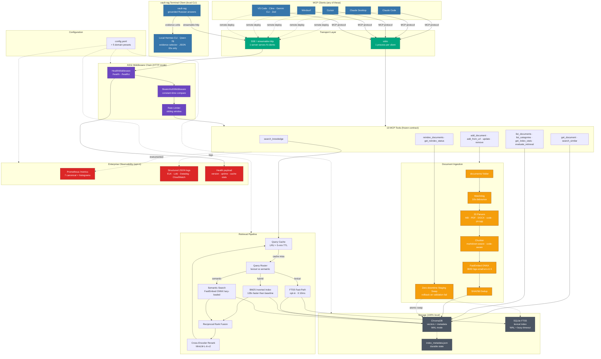

<!--
knowledge-rag — Local RAG server for Claude Code, Cursor, Windsurf and other MCP clients.
SEO keywords: local rag, mcp server, self-hosted rag, hybrid search, cross-encoder reranking, claude code rag, cursor rag, python rag, chromadb rag, fastembed rag, air-gapped rag, gdpr rag, retrieval augmented generation, model context protocol server, zero cloud rag.

Structured data (schema.org SoftwareApplication) — indexed by search engines, invisible on GitHub render:
{
  "@context": "https://schema.org",
  "@type": "SoftwareApplication",
  "name": "knowledge-rag",
  "applicationCategory": "DeveloperApplication",
  "operatingSystem": "Windows, Linux, macOS",
  "description": "Local-first RAG server for AI agents. Hybrid search, MCP-native, zero cloud, enterprise-grade plumbing (bearer auth, Prometheus metrics, rate limiting, health probes, structured JSON logging, zero-downtime reindex).",
  "offers": { "@type": "Offer", "price": "0", "priceCurrency": "USD" },
  "license": "https://opensource.org/licenses/MIT",
  "downloadUrl": "https://pypi.org/project/knowledge-rag/",
  "codeRepository": "https://github.com/lyonzin/knowledge-rag",
  "programmingLanguage": "Python",
  "runtimePlatform": "Python 3.11+"
}
-->

# knowledge-rag

<div align="center">

[](https://pypi.org/project/knowledge-rag/)
[](https://www.npmjs.com/package/knowledge-rag)
[](https://pepy.tech/projects/knowledge-rag)


[](https://github.com/lyonzin/knowledge-rag/actions/workflows/ci.yml)
[](https://github.com/lyonzin/knowledge-rag/actions/workflows/security.yml)
[](https://github.com/lyonzin/knowledge-rag/actions/workflows/quality-gate.yml)
[](https://glama.ai/mcp/servers/lyonzin/knowledge-rag)
[](https://bestpractices.coreinfrastructure.org/projects/13864)

### The MCP-first local RAG server for Claude Code, Cursor, and every AI agent.

**Hybrid search · Cross-encoder reranking · 20 file formats · 100% local · Zero cloud · Enterprise-grade plumbing built-in.**

```bash
pip install knowledge-rag   →   restart Claude Code   →   search_knowledge("your query")
```

[Quick Start](#quick-start-3-minutes-from-zero-to-your-first-query) ·
[Why knowledge-rag](#why-knowledge-rag) ·
[Compare](#how-knowledge-rag-compares-to-other-rag-frameworks) ·
[Enterprise Features](#enterprise-features-built-in-zero-configuration) ·
[Docs](#documentation)

</div>

---

## ⭐ Star History

<div align="center">

<a href="https://www.star-history.com/?repos=lyonzin%2Fknowledge-rag&type=date&legend=top-left">
  
</a>

<sub>Chart updated daily by <a href="./.github/workflows/update-star-history.yml">GitHub Action</a></sub>

</div>

---

## 🎯 Why knowledge-rag

Most RAG frameworks fall into one of three traps: (1) they require you to ship your data to a cloud API, (2) they hand you 300 building blocks and 0 opinionated defaults, or (3) they bundle RAG as a 5% feature of a much bigger platform you didn't ask for.

**knowledge-rag does one thing well:** it is the MCP-native local RAG server that Claude Code, Cursor, Windsurf, VS Code, Cline, Gemini CLI and Zed can search out of the box — with enterprise plumbing (bearer auth, Prometheus metrics, rate limiting, health probes, structured JSON logging, zero-downtime reindex) that no other RAG-focused OSS ships built-in.

<table>
<tr>
<td width="50%" valign="top">

### 🔒 100% local, 0% cloud
Your files never leave the machine. No vendor lock-in, no data-residency headache, no forced cloud dependency. **LGPD / GDPR / HIPAA compliant by architecture** — because there is nothing to comply about when nothing leaves.

</td>
<td width="50%" valign="top">

### 🚀 Zero-friction setup
`pip install knowledge-rag` → restart your MCP client → done. **No Docker mandatory. No Ollama required. No separate embedding server.** Everything runs in-process via FastEmbed ONNX. **Works offline** after the first model download.

</td>
</tr>
<tr>
<td width="50%" valign="top">

### 🛡️ Production-grade OSS
7-pillar quality gate on every PR (**35+ automated checks**), 9-cell OS×Python CI matrix (Linux + Windows + macOS × 3.11/3.12/3.13), nightly chaos + 50K-iteration soak + mutation testing. **700+ tests. 0 known regressions.**

</td>
<td width="50%" valign="top">

### 💰 Zero ongoing cost
No token bills. No SaaS tier. No paid features hidden behind a wall. **MIT license, forever.** Runs on the laptop you already have — GPU optional, CPU works fine with FastEmbed ONNX.

</td>
</tr>
</table>

---

## 📊 How knowledge-rag compares to other RAG frameworks

We audited **16 popular RAG frameworks and platforms** (LlamaIndex, LangChain, ChromaDB, Weaviate, Qdrant, RAGFlow, LightRAG, DSPy, GraphRAG, Haystack, RAG-Anything, kotaemon, txtai, llmware, Dify, open-webui, FastGPT) so you can pick honestly.

**Legend:** ✅ built-in · 🟡 plugin / paid tier / partial · ❌ not available · ⚠️ license or default concern

| Dimension | 🎯 **knowledge-rag** | LlamaIndex | LangChain | Haystack | RAGFlow | txtai | open-webui | Dify | Qdrant |
|---|:---:|:---:|:---:|:---:|:---:|:---:|:---:|:---:|:---:|
| **100% local, zero cloud** | ✅ | 🟡 | ✅ | 🟡 | 🟡 | ✅ | ✅ | 🟡 | 🟡 |
| **MCP native (Claude/Cursor)** | ✅ 13 tools | 🟡 pkg | 🟡 adapter | 🟡 wrapper | 🟡 add-on | ✅ | ✅ consumer | ✅ | ❌ |
| **Hybrid BM25 + semantic** | ✅ 128× faster | 🟡 | 🟡 | ✅ | ✅ | ✅ | ✅ | ✅ | ✅ |
| **Cross-encoder rerank** | ✅ builtin | ❌ | 🟡 | ✅ | ✅ fused | ❌ | ✅ | 🟡 | 🟡 |
| **Bearer auth builtin** | ✅ | ❌ | ❌ | ❌ core | ❌ | 🟡 | ✅ RBAC | ✅ OAuth2 | ✅ |
| **Prometheus `/metrics`** | ✅ | ❌ | ❌ | ❌ core | ❌ | ❌ | ✅ OTel | ❌ | ✅ |
| **Rate limiting** | ✅ sliding-window | ❌ | ❌ | ❌ | ❌ | ❌ | ✅ | ✅ | ✅ |
| **Health probes** (`/health`) | ✅ | ❌ | ❌ | ❌ | ❌ | ❌ | 🟡 | 🟡 | ✅ |
| **Structured JSON logging** | ✅ opt-in | ❌ | ❌ | ❌ | ❌ | ❌ | ✅ OTel | 🟡 | ✅ |
| **Zero-downtime reindex** | ✅ | ❌ | ❌ | ❌ | ❌ | ❌ | ❌ | ❌ | ✅ |
| **Async background reindex** | ✅ + polling | ❌ | ❌ | ❌ | ❌ | ❌ | ❌ | ❌ | 🟡 |
| **GPU CUDA optional** | ✅ 12 auto | ❌ | 🟡 | ✅ | ✅ | ✅ | ✅ | 🟡 | 🟡 |
| **File formats builtin** | ✅ **20** | 0 (LlamaParse=$) | 50+ plugins | ✅ **36+** | 8+ | ? | ? | ~10 | ❌ |
| **Setup < 5 min POC** | ✅ pip 1-liner | ✅ | ✅ | ✅ | ❌ 16GB RAM | ✅ | ✅ docker | ✅ docker | ✅ |
| **Nightly chaos + soak + mutation** | ✅ | ❌ | ❌ | ❌ | ❌ | ❌ | ❌ | ❌ | ❌ |
| **License** | ✅ MIT | MIT | MIT | Apache-2.0 | Apache-2.0 | Apache-2.0 | ⚠️ preserving | ⚠️ restrictive | Apache-2.0 |

> **The 5 dimensions where knowledge-rag is unique:** health probes + JSON logging + Prometheus + rate limit + bearer auth **simultaneously built-in on an OSS RAG-focused MCP server**. Zero-downtime reindex + async background reindex + nightly chaos/soak/mutation are documented on nobody else's README.

---

## 🚀 Quick Start (3 minutes, from zero to your first query)

Pick your integration path — knowledge-rag ships the same server through every channel.

### Path 1 — Claude Code, Cursor, Windsurf, Cline, VS Code, Gemini CLI, Zed (MCP)

```bash
pip install knowledge-rag
knowledge-rag init                    # scaffolds config.yaml + documents/
```

Drop your PDFs, markdown, code files into `documents/`. Restart your MCP client. Ask it:

```
search_knowledge("your query")
```

That's it. First query loads the ONNX embedding model (~200MB, one-off download). Subsequent queries are cached and hit sub-second latency.

### Path 2 — HTTP / SSE server (multi-user, air-gapped, load-balanced)

```yaml
# config.yaml
server:
  transport: "sse"                    # or "streamable-http"
  host: "0.0.0.0"
  port: 8179
  auth:
    bearer_token: "your-secret-token"
  rate_limit:
    enabled: true
    requests_per_minute: 60
  metrics:
    enabled: true
    port: 9179
  logging:
    format: "json"                    # ELK / Loki / Datadog / CloudWatch ready
```

```bash
knowledge-rag --transport sse
```

- Health probe: `curl http://your-host:8179/health` → 200 + JSON payload
- Prometheus scrape: `http://your-host:9179/metrics`
- MCP dispatcher: authenticated via `Authorization: Bearer your-secret-token`

### Path 3 — Docker (models pre-downloaded, air-gapped ready)

```bash
docker pull ghcr.io/lyonzin/knowledge-rag:latest
docker run -v $(pwd)/documents:/app/documents -p 8179:8179 ghcr.io/lyonzin/knowledge-rag:latest
```

**Full installation guide with all 5 methods, 8 MCP client configurations, and GPU setup:** [docs/INSTALLATION.md →](docs/INSTALLATION.md)

---

## 🤖 Ready-to-use skills for AI agents

Installing knowledge-rag gives your agent 13 MCP tools. It does not tell the agent **when** to use them. That is what the [`skills/`](skills/) folder solves — drop-in behavioural skills for Claude Code, Cursor, Windsurf, Cline, Zed, VS Code Copilot that turn "AI with access to RAG" into "AI that actually uses RAG first".

**10 skills, MIT licensed, organized by kind:**

| # | Skill | What it does |
|---|---|---|
| 1 | [`rag-check-first`](skills/foundation/rag-check-first/SKILL.md) | Search the corpus **before** answering any technical claim |
| 2 | [`rag-cite-sources`](skills/foundation/rag-cite-sources/SKILL.md) | Every claim ships with `path:line` citations |
| 3 | [`rag-onboard-context`](skills/foundation/rag-onboard-context/SKILL.md) | First interaction of a session probes what is indexed |
| 4 | [`rag-deep-dive`](skills/workflow/rag-deep-dive/SKILL.md) | 3-step drill: `search` → `fetch` → `find similar` |
| 5 | [`rag-web-fallback`](skills/workflow/rag-web-fallback/SKILL.md) | Only hit the web when local RAG comes back empty |
| 6 | [`rag-troubleshoot`](skills/workflow/rag-troubleshoot/SKILL.md) | Bug / error → RAG first for prior fixes |
| 7 | [`rag-code-review`](skills/workflow/rag-code-review/SKILL.md) | Review consults ADRs / patterns before commenting |
| 8 | [`rag-index-decisions`](skills/maintenance/rag-index-decisions/SKILL.md) | After a decision, index it back — close the feedback loop |
| 9 | [`rag-security-first`](skills/domain/rag-security-first/SKILL.md) | Security tasks: MITRE / CVE / runbook first |
| 10 | [`rag-evaluate-quality`](skills/maintenance/rag-evaluate-quality/SKILL.md) | Weekly checkup — MRR@5 · Recall@5 · Precision@5 |

**Install — pick the shortest path for your machine:**

```bash
# Option 1 — Via skills.sh (needs Node — one command, zero clone)
npx skills add lyonzin/knowledge-rag

# Option 2 — Via our install.sh (no Node needed; works on Linux/macOS/WSL/Git Bash)
curl -fsSL https://raw.githubusercontent.com/lyonzin/knowledge-rag/master/skills/install.sh | bash
```

Both restart-Claude-Code and you are done. Option 2 supports `--project`, `--only rag-check-first,rag-cite-sources`, `--dry-run`, `--help`.

For Cursor, Windsurf, Cline and full manual instructions → [skills/README.md](skills/README.md) · Full catalog with skill chains → [skills/CATALOG.md](skills/CATALOG.md)

---

## 🛠️ The 13 MCP tools your agent gets

Once installed, your AI agent gets these 13 tools automatically:

| Tool | Purpose |
|---|---|
| `search_knowledge` | Hybrid semantic + BM25 with cross-encoder rerank |
| `get_document` | Retrieve full content of one document |
| `search_similar` | Find documents similar to a reference |
| `evaluate_retrieval` | Measure MRR@5 · Recall@5 · Precision@5 |
| `add_document` | Index a new document via MCP |
| `update_document` | Re-index a changed document |
| `remove_document` | Drop a document + all its chunks |
| `add_from_url` | Fetch, sanitize, and index a URL |
| `list_documents` | Enumerate indexed documents |
| `list_categories` | Auto-tagged by folder path |
| `get_index_stats` | Corpus size, cache hit rate, embedding dim |
| `reindex_documents` | Smart incremental OR nuclear rebuild |
| `get_reindex_status` | Live progress polling (async reindex) |

**Full API reference with parameter details, return schemas, examples:** [docs/API.md →](docs/API.md)

---

## 🏢 Enterprise Features (built-in, zero configuration)

Every RAG framework claims "production-ready." Here is what knowledge-rag ships **in the OSS core, verified by regression tests, that competitors either paywall, plugin-ify, or simply don't have.**

<table>
<tr>
<td valign="top" width="50%">

### Security

- **Bearer token auth** on SSE / HTTP transports — constant-time comparison (`hmac.compare_digest`), RFC 6750 challenge, 401 fenced with `WWW-Authenticate` header
- **Path traversal + symlink escape defenses** — `validate_path_within` guarding 6 CRUD tools (CWE-22, CWE-59)
- **Prompt injection 3-layer defense** — sentinel neutralization + provenance fence + `external_source` flag (OWASP LLM01:2025)
- **OpenSSF Best Practices badge** verified · **CodeQL** weekly scan · **Bandit + Semgrep + Gitleaks + pip-audit** on every PR
- **PyPI Trusted Publishing** via OIDC (zero long-lived tokens in CI)

</td>
<td valign="top" width="50%">

### Observability

- **Prometheus `/metrics` endpoint** — custom histogram buckets tuned for RAG (p95 ≤ 10ms fast-path targets), 7 canonical metrics via `@instrument` decorator on all 13 tools
- **Rate limiting** — thread-safe sliding-window counter, per-client RPM + burst, zero overhead when disabled
- **Health probes** — `GET /health` and `/healthz` returning `{status, version, uptime_seconds, cache}` in front of the auth middleware (probes always succeed)
- **Structured JSON logging** — opt-in via `server.logging.format: "json"`, one JSON object per record ready for ELK / Loki / Datadog / CloudWatch
- **Public benchmark dashboard** on GitHub Pages

</td>
</tr>
<tr>
<td valign="top" width="50%">

### Scale & performance

- **SSE / streamable-http transport** — 1 server serves N MCP clients, ChromaDB WAL mode enabled automatically, shared embedding model + query cache
- **BM25 inverted-index** — **128× faster** than linear scan (custom implementation, replaces `rank-bm25`)
- **FTS5 SQLite fast-path** (opt-in, ADR-002/003/006/008) — <10ms cold, <2ms hot on lexical queries
- **Cross-encoder reranking** — Xenova/ms-marco-MiniLM-L-6-v2, +1.88pp Recall@10 (p<0.001)
- **GPU CUDA 12** with auto DLL discovery + graceful CPU fallback
- **Query cache** — LRU + 5-min TTL, cuts p95 latency ~40%
- **Zero-downtime reindex** — staging populate + validation + atomic swap + durable metadata rollback
- **Async background reindex** with `get_reindex_status()` polling

</td>
<td valign="top" width="50%">

### Reliability

- **Nightly chaos injection** — HuggingFace Hub offline · ONNX zero-byte replay · watchdog crash recovery (3 scenarios in `tests/chaos/`)
- **50 000-iteration soak test** — proves no memory leak after 1h of continuous queries (`KNOWLEDGE_RAG_SOAK_ITERATIONS=50000`)
- **Mutation testing** (mutmut) on `instance_lock` + `preflight` — catches tests that are too weak
- **Determinism check** — full test suite × 3, catches flakes
- **Backwards-compat frozen** — 13 MCP tool parameter names guarded by `tests/test_backwards_compat.py` + legacy YAML fixtures (v3.6.0 / v3.7.0) still parse
- **API surface AST diff** — `check_api_surface.py` blocks any breaking change at PR time
- **9-cell CI matrix** — Linux + Windows + macOS × 3.11 + 3.12 + 3.13

</td>
</tr>
</table>

---

## 💼 Use Cases (real corpora, real teams)

### Security Teams — Red / Blue / CTF

**Preset:** [`cybersecurity.yaml`](presets/cybersecurity.yaml) · 8 categories · 200+ routing keywords · 69 query expansions

Ingest MITRE ATT&CK, threat reports, exploit writeups, incident reports. Search from Claude Code with `search_knowledge("privilege escalation windows")` and get instant recall across your entire corpus. Air-gapped — nothing leaves the laptop.

### Development Teams — Design Docs, Runbooks, Code

**Preset:** [`developer.yaml`](presets/developer.yaml) · 9 categories · 150+ routing keywords · 50+ expansions

Replace Confluence hunting. Ingest architecture docs, ADRs, runbooks, code, API specs. Devs ask their AI agent "how do we authenticate the payment service" and get the exact ADR + implementation file citation.

### Research Labs — Papers, Notebooks, Datasets

**Preset:** [`research.yaml`](presets/research.yaml) · 9 categories · 100+ routing keywords · 40+ expansions

Index arXiv papers, lab notebooks, dataset documentation. Semantic search finds papers by intent, not just keywords — cross-encoder reranking surfaces the actually-relevant one instead of five that share a term.

### Enterprise Knowledge Base — Air-gapped, Auditable

**Preset:** [`general.yaml`](presets/general.yaml) · blank slate, pure semantic search

Deploy via SSE on a single VM. 40+ users authenticated via bearer token, rate-limited, Prometheus-monitored, `/health` probes wired to your load balancer, JSON logs shipped to Datadog. No cloud calls. Meets LGPD, GDPR, HIPAA data-locality requirements by design.

**Verified at scale:** production reproduction on a **5 889-doc / 75 016-chunk corpus** with concurrent queries during a nuclear rebuild — zero downtime, zero errors (see [CHANGELOG v4.8.3](CHANGELOG.md#v483-2026-08-10--critical-hotfix-nuclear-rebuild--smart-reindex-hardening)).

---

## 🏗️ Architecture at a glance

End-to-end view of how MCP clients, the retrieval pipeline, storage, and enterprise plumbing connect. Every arrow is a real code path — nothing pictured here is aspirational.



**Reading the diagram (top → bottom):**

1. **Any MCP client** — Claude Code, Cursor, Windsurf, and 5 others — connects via the transport of your choice (stdio for personal use, SSE/streamable-http for teams).
2. **HTTP mode chains 3 ASGI middlewares in order**: health probes first (always answered), then bearer auth (fenced with `WWW-Authenticate`), then rate limiter (sliding window).
3. **All 13 MCP tools** are decorated with `@rate_limited` + `@instrument` — Prometheus counts every call, rate limiter enforces RPM+burst, both zero-cost when disabled.
4. **`search_knowledge` checks the query cache first**; cache miss routes through the Query Router (regex classifier) to either the FTS5 fast-path (lexical) or the hybrid pipeline (BM25 + semantic + RRF + cross-encoder rerank).
5. **Storage is 100% local**: ChromaDB (WAL mode) for vectors + metadata, SQLite FTS5 (WAL + busy-timeout) for lexical fast-path, `index_metadata.json` for durable state.
6. **Document ingestion runs continuously**: watchdog observes `documents/`, 20 parsers handle each format, chunker respects language boundaries, FastEmbed ONNX generates embeddings, SHA256 deduplicates, and a staging swap performs zero-downtime rebuilds with rollback-on-failure.
7. **Enterprise observability** (opt-in) — Prometheus `/metrics`, structured JSON logs, `/health` payload — attaches to the same instrumentation points, no code changes required.
8. **`config.yaml` (with 5 domain presets)** controls every subsystem — no environment variable spaghetti, no hardcoded paths.

**Complete architecture — 4 detailed Mermaid diagrams (System Overview · Query Flow · Document Ingestion · hybrid_alpha effect):** [docs/ARCHITECTURE.md](docs/ARCHITECTURE.md)

---

## 📄 20 File Formats — parsed natively, no plugins needed

Every parser is **chunk-aware** — Markdown splits at `##` headers, code splits at function/class boundaries, notebooks skip base64 outputs, PDFs use PyMuPDF, spreadsheets extract sheet-by-sheet. **18 formats are enabled by default**; the 2 MetaTrader formats are opt-in (add to `documents.supported_formats` in `config.yaml`).

| # | Format | Extension | Parser | Default | Notes |
|---|--------|-----------|--------|:-------:|-------|
| 1 | Markdown | `.md` | Section-aware (splits at `##`) | Yes | Headers preserved as chunk boundaries |
| 2 | Plain Text | `.txt` | Fixed-size chunking | Yes | 1000 chars + 200 overlap |
| 3 | PDF | `.pdf` | PyMuPDF extraction | Yes | Text-based PDFs only (no OCR) |
| 4 | Word | `.docx` | python-docx | Yes | Headings preserved as markdown |
| 5 | Excel | `.xlsx` | openpyxl | Yes | Sheet-by-sheet extraction |
| 6 | PowerPoint | `.pptx` | python-pptx | Yes | Slide-by-slide extraction |
| 7 | Jupyter Notebook | `.ipynb` | Cell-aware parser | Yes | Markdown + code cells only; skips outputs/base64 |
| 8 | JSON | `.json` | Structure-aware | Yes | Flattened key-value extraction |
| 9 | CSV | `.csv` | Row-based parser | Yes | Headers + rows as text |
| 10 | XML | `.xml` | XML parser | Yes | Root element + namespace metadata |
| 11 | Python | `.py` | Code-aware parser | Yes | Functions/classes as chunks |
| 12 | C Source | `.c` | Code-aware parser | Yes | Functions / structs / includes extracted |
| 13 | C/C++ Header | `.h` | Code-aware parser | Yes | Function declarations + structs extracted |
| 14 | C++ Source | `.cpp` | Code-aware parser | Yes | Classes / structs / includes extracted |
| 15 | JavaScript | `.js` | Code-aware parser | Yes | Functions / classes / imports (ESM + CJS) |
| 16 | React JSX | `.jsx` | Code-aware parser | Yes | Same as JS parser |
| 17 | TypeScript | `.ts` | Code-aware parser | Yes | Functions / classes / interfaces / enums / imports |
| 18 | React TSX | `.tsx` | Code-aware parser | Yes | Same as TS parser |
| 19 | MQL4 Source | `.mq4` | Code parser | **No** | MetaTrader — opt-in via `documents.supported_formats` |
| 20 | MQL4 Header | `.mqh` | Code parser | **No** | MetaTrader — opt-in via `documents.supported_formats` |

> **Enable an opt-in format** — add the extension to `documents.supported_formats` in your `config.yaml`:
> ```yaml
> documents:
>   supported_formats: [".md", ".pdf", ".mq4", ".mqh"]
> ```

**Full parser reference with per-format notes:** [docs/CONFIGURATION.md](docs/CONFIGURATION.md)

---

## 🔌 Choose your MCP integration

<table>
<tr>
<td align="center" width="14%">

**Claude Code**<br/>
`~/.claude.json`

</td>
<td align="center" width="14%">

**Claude Desktop**<br/>
`claude_desktop_config.json`

</td>
<td align="center" width="14%">

**Cursor**<br/>
`~/.cursor/mcp.json`

</td>
<td align="center" width="14%">

**Windsurf**<br/>
`~/.codeium/windsurf/mcp_config.json`

</td>
<td align="center" width="14%">

**VS Code**<br/>
Copilot Chat `mcp.json`

</td>
<td align="center" width="14%">

**Cline · Gemini CLI · Zed**<br/>
Native MCP

</td>
</tr>
</table>

**Complete client configuration guide with JSON schemas per client:** [docs/INSTALLATION.md#use-with-other-mcp-clients →](docs/INSTALLATION.md#use-with-other-mcp-clients)

---

## ⚙️ Configuration in 30 seconds

```yaml
# config.yaml — everything is optional; defaults just work

paths:
  documents_dir: "./documents"
  data_dir: "./data"

models:
  embedding:
    profile: "compact"                  # "compact" | "quality" | "multilingual" | "custom"
    gpu: "auto"                         # "auto" | "true" | "false"
  reranker:
    enabled: true                       # cross-encoder rerank

search:
  default_results: 5
  max_results: 100

server:                                 # optional — SSE / HTTP mode
  transport: "stdio"                    # or "sse" / "streamable-http"
  auth:
    bearer_token: ""                    # set a secret to enable auth
  rate_limit:
    enabled: false
  metrics:
    enabled: false
  logging:
    format: "text"                      # or "json"
```

**Pre-built presets:** [`cybersecurity.yaml`](presets/cybersecurity.yaml) · [`developer.yaml`](presets/developer.yaml) · [`research.yaml`](presets/research.yaml) · [`general.yaml`](presets/general.yaml) · [`multilingual.yaml`](presets/multilingual.yaml)

**Complete configuration reference — every field, every default, tuning guide:** [docs/CONFIGURATION.md →](docs/CONFIGURATION.md)

---

## 🔒 Security & Compliance

knowledge-rag is designed for teams that cannot let their documents leave the perimeter.

| Requirement | How knowledge-rag delivers |
|---|---|
| **Data locality (LGPD / GDPR / HIPAA)** | 100% on-premise, zero egress network calls after initial model download |
| **Air-gapped deployment** | ONNX models pre-cached; set `HF_HUB_OFFLINE=1` to enforce zero-network |
| **CVE monitoring** | Dependabot (weekly) + pip-audit + Socket + CodeQL |
| **Supply chain security** | PyPI Trusted Publishing via OIDC (no long-lived tokens) |
| **Vulnerability disclosure** | Private security advisory via [SECURITY.md](SECURITY.md) |
| **Signed release attestations** | GitHub release attestations on every published version |
| **Reproducible installs** | Hash-locked `requirements.lock` (`--require-hashes`) — the canonical production install input for Docker, CI, and releases |
| **Authenticated access** | Bearer token middleware on SSE / HTTP transports (constant-time compare, RFC 6750) |
| **Rate limiting** | Sliding-window per-client RPM + burst (opt-in, zero-cost when disabled) |
| **Audit-ready logging** | Opt-in structured JSON logs → ship to your SIEM |
| **Path traversal defenses** | CWE-22 / CWE-59 guards on 6 CRUD tools |
| **Prompt injection defense** | 3-layer sanitization on `add_from_url` (OWASP LLM01:2025) |

**OpenSSF Best Practices** badge: passing · project ID [#13864](https://bestpractices.coreinfrastructure.org/projects/13864)

---

## 📈 Numbers that matter

- **26 000+** total downloads on PyPI · **250+** GitHub stars · **70+** enterprise teams (private + community)
- **700+ tests** collected · **1.33:1** test-to-code ratio · **codecov trend gate** ±0.5pp
- **35+ status checks** on every PR (9-cell OS×Python matrix · 7 quality pillars)
- **20 file formats** parsed natively · **13 MCP tools** frozen · **5 domain presets** (cyber · dev · research · multilingual · general)
- **BM25 128× faster** than baseline · **cross-encoder +1.88pp** Recall@10 (p<0.001) · **cache −40%** p95 latency
- **1 800+ files / 39 K chunks indexed in < 3 min** on a modern laptop (typical developer corpus)
- **Verified in production** on 5 889-doc / 75 016-chunk corpora

**Public benchmark dashboard:** https://lyonzin.github.io/knowledge-rag/

---

## 📚 Documentation

| Doc | What's inside |
|---|---|
| [**Installation guide**](docs/INSTALLATION.md) | 5 install methods · 8 MCP client integrations · GPU setup |
| [**API reference**](docs/API.md) | Complete reference for all 13 MCP tools |
| [**Configuration reference**](docs/CONFIGURATION.md) | Every `config.yaml` field · presets · tuning |
| [**Architecture**](docs/ARCHITECTURE.md) | 4 Mermaid diagrams: System Overview · Query Flow · Ingestion · hybrid_alpha |
| [**Troubleshooting**](docs/TROUBLESHOOTING.md) | 11 common issues + solutions |
| [**FTS5 fast-path guide**](docs/features/fts5_fast_path.md) | Opt-in lexical fast-path — when and how |
| [**Reindex operations**](docs/reindex-operations.md) | Zero-downtime rebuild · resume · checkpoint |
| [**GPU setup**](docs/gpu-setup.md) | CUDA 12 installation + troubleshooting |
| [**Migration to v4.8.0**](docs/migration-v4.8.0.md) | Embedding profile · multilingual · zero-downtime |
| [**Security policy**](SECURITY.md) | Threat model · disclosure channel |
| [**Contributing**](CONTRIBUTING.md) | Development · testing · PR process |
| [**Changelog**](CHANGELOG.md) | All release notes since v1.0.0 |

---

## 🤝 Community & Support

- **Report a bug** → [Open an issue](https://github.com/lyonzin/knowledge-rag/issues/new/choose)
- **Ask a question** → [GitHub Discussions](https://github.com/lyonzin/knowledge-rag/discussions)
- **Report a vulnerability** → [Security advisory](https://github.com/lyonzin/knowledge-rag/security/advisories/new) (private)
- **Contribute** → [CONTRIBUTING.md](CONTRIBUTING.md)

**Response SLA (best-effort, community project):**
- Security reports: within 48 h
- Bug reports with reproduction: within 5 business days
- Feature requests: triaged on next release cycle

---

## 🗺️ Recent releases

- **v4.9.1** (2026-08-15) — Versioned serving opens Chroma only from a receipt-verified process-local copy, preserving the physically write-denied published generation; safe startup drift detail is retained.
- **v4.9.0** (2026-08-15) — Release/runtime reproducibility: hash-locked `requirements.lock` as the canonical install input (Docker/CI/release), dependency-lock ↔ installed parity at generation build and runtime recheck, typed `advanced.watch_for_changes` / `watch_debounce_seconds`, all five presets (incl. multilingual) shipped in wheel/sdist
- **v4.8.5** (2026-08-13) — Enterprise observability: `/health` endpoint + opt-in JSON structured logging
- **v4.8.4** (2026-08-13) — Patch: security + durability + defensive fixes
- **v4.8.3** (2026-08-10) — Critical hotfix: nuclear-rebuild + smart-reindex hardening on 50k+ chunk corpora
- **v4.8.2** (2026-08-10) — FTS5 lexical fast-path opt-in release
- **v4.8.0** (2026-08-06) — Multilingual foundation + zero-downtime reindex

**Full history:** [CHANGELOG.md →](CHANGELOG.md)

---

## 📜 License

**MIT License** — [LICENSE](LICENSE). Forever. No cloud upsell, no dual-licensing, no restrictive clauses. Fork it, sell derivatives, embed it in commercial products — the license does not care.

---

## 🙏 Acknowledgments

Built on the shoulders of amazing open-source projects:

- [**Anthropic MCP**](https://modelcontextprotocol.io/) — Model Context Protocol spec + Python SDK
- [**ChromaDB**](https://www.trychroma.com/) — vector database that just works
- [**FastEmbed**](https://github.com/qdrant/fastembed) — ONNX embeddings, no PyTorch bloat
- [**HuggingFace**](https://huggingface.co/) — model hosting + `Xenova/ms-marco-MiniLM-L-6-v2` cross-encoder
- [**BAAI**](https://huggingface.co/BAAI) — the `bge-small-en-v1.5` embedding model

**Community contributors:** [@Hohlas](https://github.com/Hohlas) · [@eeshsaxena](https://github.com/eeshsaxena) · Sergey Khokhlov · and everyone who filed issues or PRs.

---

<div align="center">

**Built by [Ailton Rocha (Lyon.)](https://github.com/lyonzin)** · Star ⭐ if this saves you time · [Report an issue](https://github.com/lyonzin/knowledge-rag/issues/new/choose) · [Contribute](CONTRIBUTING.md)

*knowledge-rag — the MCP-first local RAG server for Claude Code, Cursor, Windsurf, and every AI agent.*

</div>
