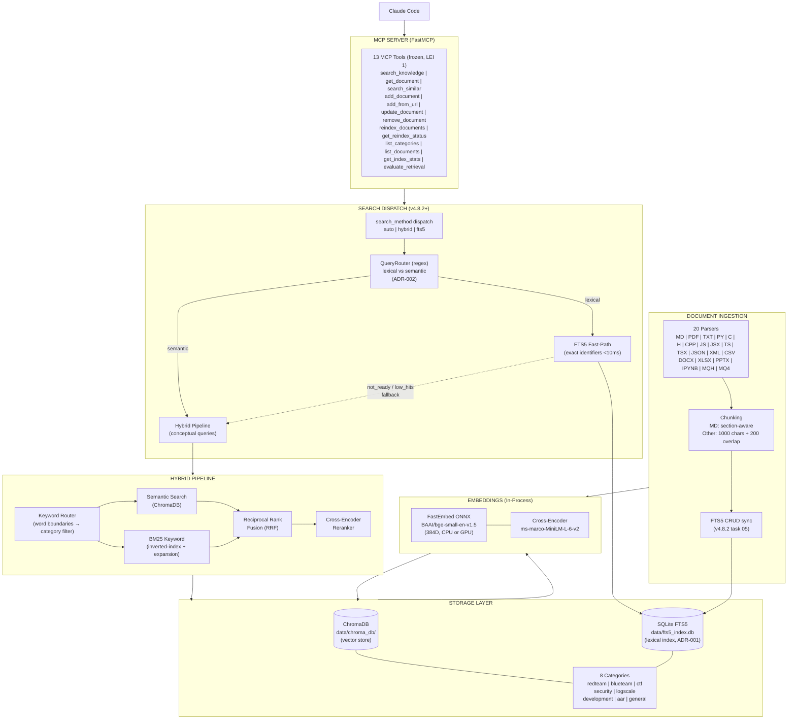
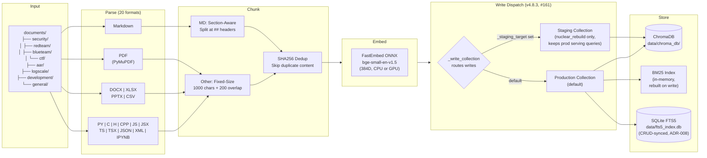
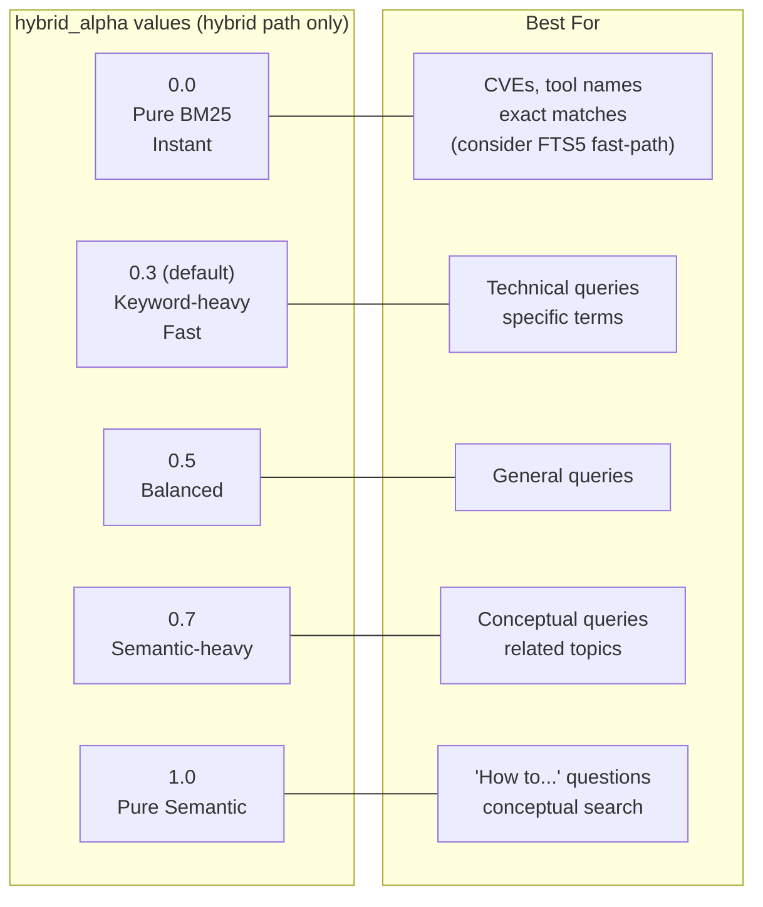

# Architecture

> Detailed architecture of **knowledge-rag** — system overview, query processing flow, document ingestion pipeline, and the hybrid_alpha parameter effect.

**Related docs:**
- [Configuration reference →](CONFIGURATION.md)
- [API reference →](API.md)
- [Installation guide →](INSTALLATION.md)

**Diagrams inside:**
- [System Overview](#system-overview)
- [Query Processing Flow](#query-processing-flow)
- [Document Ingestion Flow](#document-ingestion-flow)
- [hybrid_alpha Parameter Effect](#hybrid_alpha-parameter-effect)

---

### System Overview

### Query Processing Flow

```mermaid
flowchart TB
    QUERY["User Query<br/>'mimikatz credential dump' | 'CVE-2021-4034'"] --> METHOD

    subgraph DISPATCH["Dispatch (v4.8.2+, ADR-006)"]
        METHOD{"search_method<br/>auto | hybrid | fts5"}
        AUTOROUTE["QueryRouter.classify()<br/>regex-based lexical detection"]
        FASTPATH["FTS5 Fast-Path<br/>SQLite MATCH<br/>(&lt;10ms cold, &lt;2ms hot)"]
        NOTREADY{"FTS5 ready<br/>AND hits >= min_hits?"}

        METHOD -->|auto| AUTOROUTE
        METHOD -->|fts5| FASTPATH
        METHOD -->|hybrid| EXPAND
        AUTOROUTE -->|lexical| FASTPATH
        AUTOROUTE -->|semantic| EXPAND
        FASTPATH --> NOTREADY
        NOTREADY -->|no, fallback| EXPAND
    end

    subgraph EXPANSION["Query Expansion (hybrid path)"]
        EXPAND["Synonym Expansion<br/>mimikatz -> mimikatz, sekurlsa, logonpasswords"]
    end

    EXPAND --> KWROUTER

    subgraph ROUTING["Keyword Routing (category filter)"]
        KWROUTER["Keyword Router<br/>(word boundaries)"]
        MATCH{"Word Boundary<br/>Match?"}
        CATEGORY["Filter: redteam"]
        NOFILTER["No Filter"]

        KWROUTER --> MATCH
        MATCH -->|Yes| CATEGORY
        MATCH -->|No| NOFILTER
    end

    subgraph HYBRID["Hybrid Search"]
        direction LR
        SEMANTIC["Semantic Search<br/>(ChromaDB embeddings)<br/>Conceptual similarity"]
        BM25["BM25 Inverted-Index<br/>(posting lists + numpy top-k)<br/>Exact term matching"]
    end

    subgraph FUSION["Result Fusion + Reranking"]
        RRF["Reciprocal Rank Fusion<br/>score = alpha * 1/(k+rank_sem)<br/>+ (1-alpha) * 1/(k+rank_bm25)"]
        RERANK["Cross-Encoder Reranker<br/>Re-scores top 3x candidates<br/>query+doc pair scoring"]
        SORT["Sort by Reranker Score<br/>Normalize to 0-1"]
        ADJ["Adjacent Chunk Expansion<br/>(batch fetch ±1 chunk)"]

        RRF --> RERANK --> SORT --> ADJ
    end

    subgraph OUTPUT["Output Processing"]
        MINSCORE["min_score Filter<br/>(filters query_relative_score —<br/>cohort-normalized, query-relative only)"]
        SNIPPET["snippet_mode Truncation<br/>(~500 chars at natural break)"]

        MINSCORE --> SNIPPET
    end

    CATEGORY --> HYBRID
    NOFILTER --> HYBRID
    SEMANTIC --> RRF
    BM25 --> RRF

    ADJ --> MINSCORE
    NOTREADY -->|yes, hit| MINSCORE
    SNIPPET --> RESULTS["Results<br/>search_method: fts5 | hybrid | semantic | keyword<br/>routed_by: fts5_router | none<br/>raw_score + query_relative_score (score = legacy alias)<br/>+ score_source + filtered_by_score<br/>+ filtered_by_query_relative_score + content_length"]
```

### Document Ingestion Flow

### hybrid_alpha Parameter Effect

`hybrid_alpha` weights RRF fusion between semantic and BM25 rankings on the **hybrid pipeline only**. When `search_method="auto"` and the QueryRouter classifies the query as lexical (e.g. `CVE-2021-4034`, `MDR-AD002`, `T1078.001`, file hashes), the FTS5 fast-path fires and `hybrid_alpha` is not consulted — FTS5 uses SQLite's native `bm25()` scoring exclusively. Pass `search_method="hybrid"` to force RRF fusion + rerank on every query if you want deterministic hybrid semantics regardless of the query shape.

---

